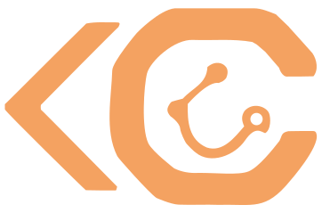

# CodeCrafted

### Code & Passion

**Développement, programmation, sciences et passions poussées dans leurs retranchements.**

Une plateforme sociale où l'astrophotographie et la pêche ont chacune leur univers.
Depuis Bordeaux. 🇫🇷

[**codecrafted.fr**](https://codecrafted.fr) • [Astrophotographie](https://codecrafted.fr/astrophoto) • [Pêche](https://codecrafted.fr/peche) • [Projets](https://codecrafted.fr/projets) • [Contact](https://codecrafted.fr/contact)

---

## La plateforme

CodeCrafted réunit **deux communautés de passionnés** autour d'un même socle social. Chaque univers possède ses galeries, ses statistiques, ses classements et ses trophées ; les amitiés, la messagerie et les notifications, elles, traversent les deux.

L'inscription est **libre et gratuite** sur [codecrafted.fr](https://codecrafted.fr).

 

### 🔭 Astrophotographie

Publiez vos clichés du ciel profond — la plateforme se charge du reste.

**Vos objets célestes sont identifiés automatiquement.** À partir de l'image seule, sans coordonnées ni métadonnées à renseigner, le champ photographié est analysé, les objets qu'il contient sont reconnus, nommés et décrits **dans votre langue** : galaxies, nébuleuses, amas, étoiles.

- 🎯 **Identification automatique** des objets présents sur vos photos
- 📖 **Fiches enrichies** par les grands catalogues astronomiques de référence
- 🌤️ **Conditions d'observation en temps réel** — météo, score astronomique, phase lunaire, crépuscules et heures d'obscurité totale, passages ISS, alertes aurores boréales
- 🖼️ **Galerie & communauté** — likes, commentaires, notations, classements
- 📷 **Métadonnées EXIF** et matériel associés à chaque cliché

 

### 🎣 Pêche

Un carnet de bord vivant pour vos sorties.

- 🐟 **Prises & espèces** — galerie, journal de sessions, statistiques personnelles
- 🌊 **Conditions de pêche** — score global calculé à partir de la météo, du vent, de la pression, de la température de l'eau et des marées, avec recommandations et meilleurs créneaux
- 🗺️ **Spots et techniques** — eau douce comme eau de mer
- 🏅 **Communauté & défis** — classements, comparaisons, partage entre pêcheurs

 

### 👥 Le socle commun

Amitiés, messagerie instantanée, notifications, invitations : un seul compte, une seule communauté, quel que soit l'univers où vous naviguez. Le tout **en temps réel**.

 

### 🏆 104 trophées

De la première photo publiée aux exploits les plus confidentiels, **104 trophées répartis sur 6 niveaux de rareté** — de *Common* à *Secret* — se débloquent automatiquement au fil de votre progression. 64 côté astrophotographie, 40 côté pêche.

---

## Sous le capot

Une architecture **microservices conteneurisée**, pensée pour que chaque brique évolue à son rythme :

| | |
|---|---|
| 🖥️ **Application web** | Interface publique en rendu serveur, multilingue, responsive |
| ⚙️ **API** | Cœur métier : comptes, contenus, social, trophées, temps réel |
| 🛡️ **Administration** | Back-office de modération et de pilotage multi-univers |
| 🔭 **Service astronomique** | Résolution et identification des objets célestes, isolé du reste de la plateforme |

Chaque service vit dans son propre dépôt, agrégés par un monorepo d'orchestration. Intégration et déploiement continus vers les environnements de staging et de production à chaque évolution.

---

## Technologies

---

## En quelques chiffres

| | |
|---|---|
| 🏆 Trophées | **104** sur 6 raretés |
| 🌌 Catalogues astronomiques | **9** — plus de 10 000 objets référencés |
| 🌍 Objets traduits | **10 langues** |
| ✅ Tests automatisés | **2 351**, tous au vert |
| 🧩 Services conteneurisés | **7** |

---

## Les dépôts

Les dépôts de cette organisation sont **privés** : CodeCrafted est un projet propriétaire, et son code source n'est pas ouvert. Cette page présente le projet — pour le voir à l'œuvre, rendez-vous sur [codecrafted.fr](https://codecrafted.fr).

---

### Une question, une idée, un projet ?

© CodeCrafted — Bordeaux, France

